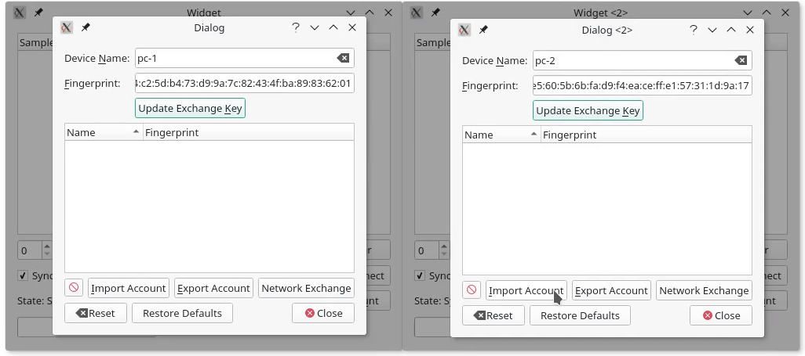

# QtDataSync
A simple offline-first synchronisation framework, to synchronize data of Qt applications between devices.

[](https://travis-ci.org/Skycoder42/QtDataSync)
[](https://ci.appveyor.com/project/Skycoder42/qtdatasync/branch/master)
[](https://www.codacy.com/app/Skycoder42/QtDataSync?utm_source=github.com&amp;utm_medium=referral&amp;utm_content=Skycoder42/QtDataSync&amp;utm_campaign=Badge_Grade)
[](https://aur.archlinux.org/packages/qt5-datasync/)



## Features
- Document-Store like access, using QObjects and Q_GADGET classes
	- Threadsafe synchronous access with global caching optimizations
	- Change signals on data modifications
- Cross platform library, works on linux, windows, macos, android and ios and can be used to synchronize data between any of these platforms
- Qt "model" class (`QAbstractListModel`) to view store data in item views
- Permanent offline storage, to make shure apps work even without network
- Remote synchronisation between devices
	- Multi-user and multi-device system - data is synchronized per user on all his devices
	- Data is stored permanently on devices, and temporarily on the server
	- Data is end to end encrypted
- Private keys are stored in secure keystores
	- Uses system keystore where possible. Currently supported:
		- KWallet
		- Freedesktop Secret Service API (i.e. gnome-keyring)
		- macOs/iOs Keychain
		- Windows credentials store
		- Android Shared Preferences
		- (Unsecure) plain text keystore as fallback
	- Custom keystores can be implemented via a plugin mechanism
- Includes a server application as a backend
	- Can be used for multiple applications, independent of any data
	- Operates as "distribution" service (Does *not* permanently store data, only for transfering it to devices)
	- Operates with a PostgreSQL database
	- Includes a docker-compose file for the postgresql server
	- Is provided as docker image itself
- Controller classes to control and monitor the sync state and the account
	- Can be used in any thread
- Class to exchange user identities between devices in a local network
- Supports multi process mode (access and control data and engine from any process, with some restrictions)
- Provides convenient QML bindings

## Download/Installation
1. Package Managers: The library is available via:
	- **Arch-Linux:** AUR-Repository: [`qt5-datasync`](https://aur.archlinux.org/packages/qt5-datasync/)
	- **Ubuntu:** Launchpad-PPA: [ppa:skycoder42/qt-modules](https://launchpad.net/~skycoder42/+archive/ubuntu/qt-modules), package `libqt5datasync[4/-dev]`
	- **MacOs:**
		- Tap: [`brew tap Skycoder42/qt-modules`](https://github.com/Skycoder42/homebrew-qt-modules)
		- Package: `qtdatasync`
		- **IMPORTANT:** Due to limitations of homebrew, you must run `source /usr/local/opt/qtdatasync/bashrc.sh` before you can use the module. Some goes for the `qtjsonserializer` dependency.
2. Simply add my repository to your Qt MaintenanceTool (Image-based How-To here: [Add custom repository](https://github.com/Skycoder42/QtModules/blob/master/README.md#add-my-repositories-to-qt-maintenancetool)):
	1. Open the MaintenanceTool, located in your Qt install directory (e.g. `~/Qt/MaintenanceTool`)
	2. Select `Add or remove components` and click on the `Settings` button
	3. Go to `Repositories`, scroll to the bottom, select `User defined repositories` and press `Add`
	4. In the right column (selected by default), type:
		- On Linux: https://install.skycoder42.de/qtmodules/linux_x64
		- On Windows: https://install.skycoder42.de/qtmodules/windows_x86
		- On Mac: https://install.skycoder42.de/qtmodules/mac_x64
	5. Press `Ok`, make shure `Add or remove components` is still selected, and continue the install (`Next >`)
	6. A new entry appears under all supported Qt Versions (e.g. `Qt > Qt 5.8 > Skycoder42 Qt modules`)
	7. You can install either all of my modules, or select the one you need: `Qt Data Sync`
	8. Continue the setup and thats it! you can now use the module for all of your installed Kits for that Qt Version
3. Download the compiled modules from the release page. **Note:** You will have to add the correct ones yourself and may need to adjust some paths to fit your installation! In addition to that, you will have to download the modules this one depends on as well. See Section "Requirements" below.
4. Build it yourself! **Note:** This requires all build an runtime dependencies to be available (See Section "Requirements" below). If you don't have/need cmake, you can ignore the related warnings. To automatically build and install to your Qt installation, run:
	- `qmake`
	- `make qmake_all`
	- `make` (If you want the tests/examples/etc. run `make all`)
	- Optional steps:
		- `make doxygen` to generate the documentation
		- `make lrelease` to generate the translations
	- `make install`

## Requirements
The library as a high level synchronisation backend has a few dependencies. They are listed below by categories. When installing via a package manager or with Qt Maintenancetool (prefered methods, see section "Download/Installation"" above) all these dependencies will be installed automatically.

- Official Qt Modules:
	- QtCore (qtbase)
	- QtSql (qtbase) with the qsqlite plugin
	- QtWebSockets
	- QtScxml
	- QtRemoteObjects (currently a TP module)
- Custom Qt modules:
	- [QJsonSerializer](https://github.com/Skycoder42/QJsonSerializer)
- Additional stuff for building it yourself:
	- perl
	- [CryptoPP library](https://www.cryptopp.com/) (Can also be linked dynamically)
	- [qpmx](https://github.com/Skycoder42/qpmx)
	- [qpm](https://github.com/Cutehacks/qpm)
	- Some of the plugins also have additional dependencies:
		- kwallet: [KWallet Framework](https://api.kde.org/frameworks/kwallet/html/)
		- secretservice: libsecret-1 via pkgconfig
	- For the appserver:
		- qpsql plugin for the QtSql module

To actually run the server, it needs to connect to a SQL Database. A little more specific: A PostgreSQL database. You can specify a different one, by setting a custom database driver in the configuration file, **but** the SQL used is PostgreSQL, so unless your DBS supports the same SQL flavor, you won't be able to get it running without modifications. You can host a PostgreSQL database using docker by running `docker-compose up -d` from `tools/qdatasyncserver`. This is further described in the example explaining how to set up the server.

### Docker
The `qdsapp` is also available as docker-image, [`skycoder42/qdsapp`](https://hub.docker.com/r/skycoder42/qdsapp/). The versions are equal, i.e. QtDataSync version 4.0.0 will work with the server Version 4.0.0 as well. The server is somewhat backwards compatible. This is checked on runtime for any client that connects.

## Usage
The datasync library is provided as a Qt module. Thus, all you have to do is add the module, and then, in your project, add `QT += datasync` to your `.pro` file! Please note that when you deploy your application, you need both the library *and* the keystore plugins you intend to use.

### Basics
There are basically 3 kinds of classes typically used. This first one is the `QtDataSync::Setup`. This one is used to configure a datasync instance and synchronize data to a server. It can also be used to start a passive instance, that does not actively synchronize and only allows access to the data.

The second group are the `QtDataSync::DataStore*` classes. They are used to access the data and perform CRUD operations on it. They only work with the locally stored data, but emit signals whenever data is changed (either by another datastore, or because it was synchronized). The `QtDataSync::DataStore` is the basic class that allows you to generically access any data. The `QtDataSync::DataTypeStore` does the same, but is limited to one type. Finally, the `QtDataSync::CachingDataTypeStore` extend this by initially loading all data of one type and keeping it in the memory. This can be more efficient if our frequently access the data.

The last group are the manager classes. The `QtDataSync::SyncManager` controlls the synchronisation and reports it's status, progress and any errors. The `QtDataSync::AccountManager` is used to manage the devices data is shared with. They can be listed, added and removed. The `QtDataSync::UserExchangeManager` extends the AccountManager by making it possible to easily exchange the account data between devices in the same local network.

The examples below show how to use these different classes. For a full example of what can be done, checkout the `examples/datasync/Sample` example app.

### Example
The following examples descibe the different parts of the module, and how to use them. The following will explain how to:
- Create a setup and configure it.
- Access the storage for read/write operations
- Setup a server to synchronize with it
- Add a second device to your account to synchronize data between them

#### Initialize QtDataSync
After adding datasync to your project, the next step is to setup datasync. In your main, you need to once create a setup. This **must** be done before you create any other datasync class, but after that, you can use it in your whole application from any thread. Multi-Process setups are possible, but more complicated. See documentation for more details.

To setup datasync, simply use the Setup class:
```cpp
QtDataSync::Setup()
	.setRemoteConfiguration(QUrl("ws://localhost:4242")) //url to the server to connect to
	//do any additional setup, i.e. ".setLocalDir(...)" to specify a different local storage directory
	.create();
```

And thats it! On a second thread, the storage will be initialized. You can now use the different stores or the managers to access the data.

#### Using DataStore
The data store allows you to access the store. The store can be used by defining datatypes that can be stored in there. The only limitation is that it must be either a class that extends QObject or has the Q_GADGET macro. Only the Q_PROPERTY fields you define are stored. To identify a dataset the `USER` property is used and thus **must** be present. It's like the primary key. You can use any type you want, as long as it can be converted from and to QString via QVariant (This means `QVariant::fromType(myData).toString()`, as well as `QVariant(string).value<MyData>()` have to work as expected).

One example for such a storable datatype would be the following:
```cpp
struct Data
{
	Q_GADGET

	Q_PROPERTY(int key MEMBER int USER true)
	Q_PROPERTY(QString value MEMBER value)

public:
	Post();

	int key;
	QString value;
};
```

This can now be stored and loaded using any of the DataStore classes. The code below will save on dataset, then load all that are stored:
```cpp
auto store = new QtDataSync::DataStore(this); //Use the "default setup"

//store an entry
store->save<Data>({42, "tree"});
//load all entries
for(Data d : store->loadAll<Data>()) {
	qDebug() << d.key << d.value;
});
```

#### Setting up the remote server (qdsapp)
In order to synchronize data, some server is needed. The quickest way for development is to use the prepared docker image in the sample projects folder. Just run `docker-compose up -d` to start it. It will create a postgres as well as a qdsapp instance to be used on port 4242. More details on how to configure the the server can be found in the documentation.

Once thats done, the library will automatically connect to the server and create an account, if the server was correctly configured with the setup. To synchronize changes, all you need to do now is to add a second device to your account.

#### Adding a second device to your account
Adding a second devices is done via an exchange between those two devices. This is required to ensure no attacker can easily add himself to your account. The general idea is: You export the data from device A, then import it on device B. The part of getting the data from A to B must be done by your application, e.g. by storing it to a file or sending it over the local network. A must then accept B to be added to the account. It is also possible to secure the exported data with a password. In that case no confirmation is needed. Please note that device A must be connected to the remote for the whole login process. After device B was added, A will upload all it's local data to B. From that point on, any data changes on A or B are synchronized between the two.

The first partis to export the data from A. For this example, we use the password secured variant, as it is simpler.
```cpp
auto manager = new QtDataSync::AccountManager(this); //class used to access the account
manager->exportAccountTrusted(true, "some_password", [this](QByteArray data) {
	saveToFile(data);//somehow get the data to device B
});
```

On device B, that exported data must be read and then imported:
```cpp
auto manager = new QtDataSync::AccountManager(this); //class used to access the account
auto data = loadFromFile();
manager->importAccountTrusted(data, "some_password", [this](bool ok, QString error) {
	if(ok)
		qDebug() << "Import done!";
	else
		qDebug() << "Import failed with error:" << error;
});
```

If the import succeeded, the devices will automatically start synchronizing

## Security
The library uses end to end encryption and does not require a trusted server, as the server can neither read or write data, nor can he add a device to your account. Modern and secure crypto is used by making use of the [CryptoPP library](https://www.cryptopp.com/) library. More details on the whole (security) protocol will follow in the future.

## Documentation
The documentation is available on [github pages](https://skycoder42.github.io/QtDataSync/). It was created using [doxygen](http://www.doxygen.org/). The HTML-documentation and Qt-Help files are shipped together with the module for both the custom repository and the package on the release page. Please note that doxygen docs do not perfectly integrate with QtCreator/QtAssistant.

## References
Many of the keystore implementations have been inspired by the awesome Qt library [QtKeychain](https://github.com/frankosterfeld/qtkeychain) by frankosterfeld.
